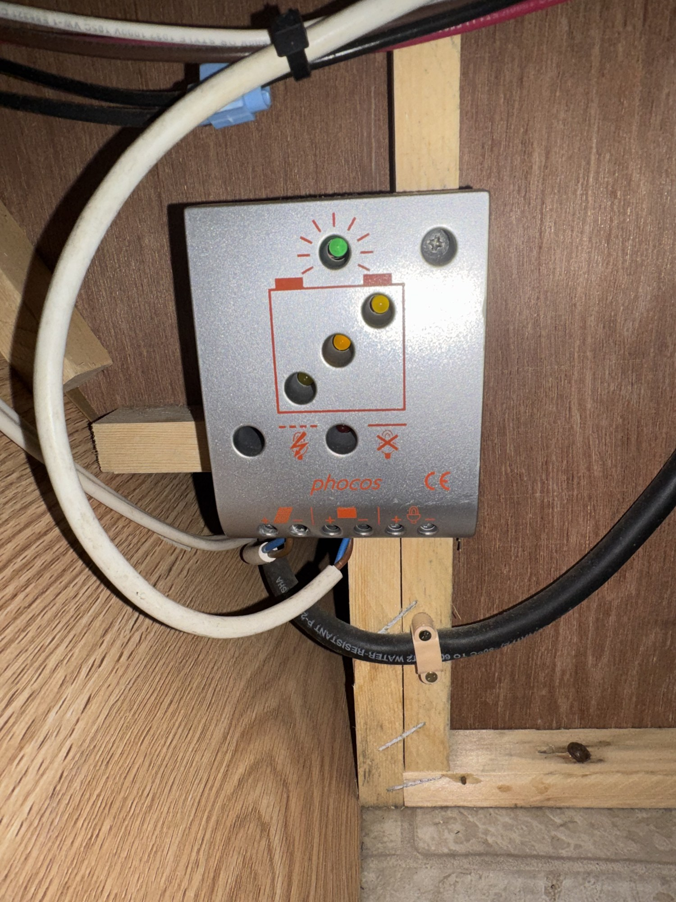
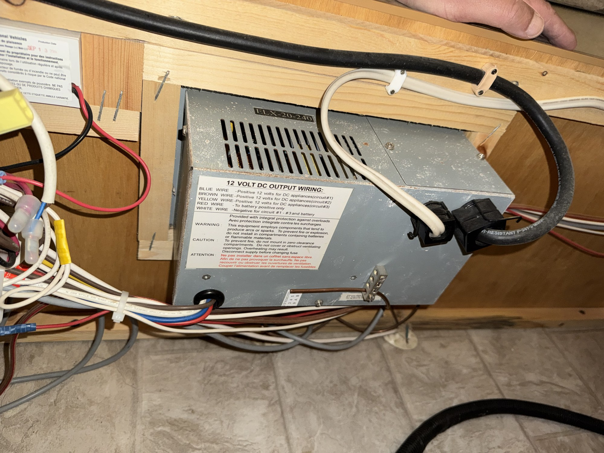
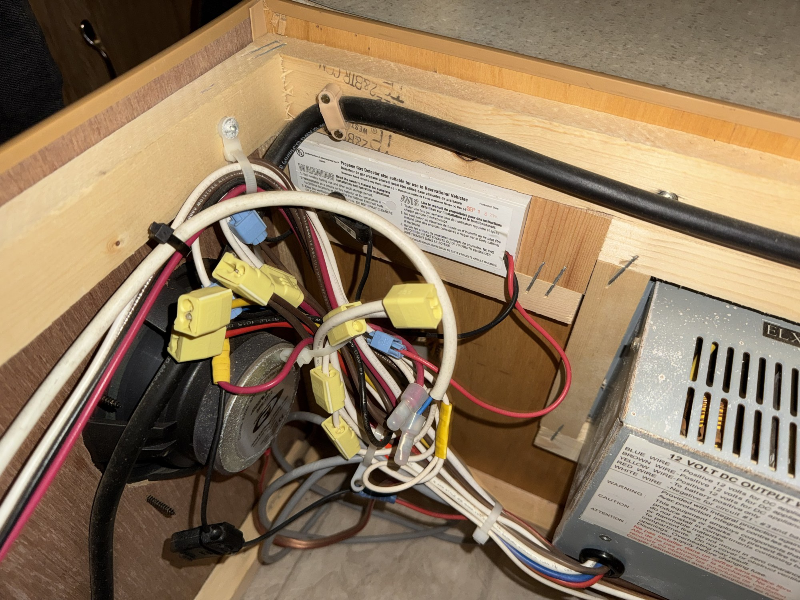
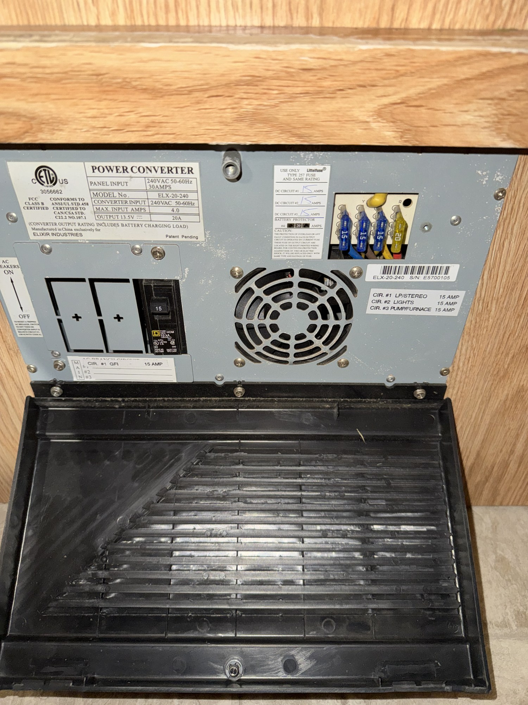

# Palomino Yearling 4102 (2007) — Owner's Manual (EU-Converted)

> **About this manual.** This is a working owner/operation manual for a **2007 Palomino
> Yearling, model 4102**, a North-American-built camper that has been **converted to
> European standards** (electrical, and where noted, other systems). It documents how the
> unit is actually wired and equipped *today*, after conversion — not the original
> factory US specification.
>
> This is a living document. Sections marked **📷 _Photos needed_** are placeholders to be
> completed as more photos are taken. Outstanding tasks and the photo shot-list live in
> **[`TODO.md`](TODO.md)**.

---

## ⚠️ Read first — Safety summary

- This camper runs on **230–240 V AC / 50 Hz** shore power (EU conversion). It is **not**
  the original 120 V / 60 Hz US system. Do **not** connect it to a US 120 V supply.
- Always connect to a **properly earthed (grounded) supply** with **RCD/RCBO protection**.
  The onboard GFCI circuit is a second layer of protection, not a replacement for a
  correctly protected supply.
- **Switch off the AC main breaker before servicing** any electrical component, and
  **disconnect the supply before changing any fuse** (see converter warnings).
- Provide **ventilation** around the power converter — never block its cooling grille or
  mount it in a zero-clearance / sealed compartment.
- Gas (LPG), if fitted, must be checked for leaks and used only with adequate ventilation.
  _(To be documented — 📷 photos needed.)_

---

## Table of contents

1. [Unit identification](#1-unit-identification)
2. [Electrical system (EU-converted)](#2-electrical-system-eu-converted)
   - [2.1 Overview](#21-overview)
   - [2.2 AC shore power & distribution panel](#22-ac-shore-power--distribution-panel)
   - [2.3 12 V DC system & power converter](#23-12-v-dc-system--power-converter)
   - [2.4 Solar charging (Phocos controller)](#24-solar-charging-phocos-controller)
   - [2.5 Battery](#25-battery)
   - [2.6 Wiring reference](#26-wiring-reference)
3. [Water system](#3-water-system) — 📷 _Photos needed_
   - [3.1 Fresh water](#31-fresh-water) · [3.2 Water heater](#32-water-heater) · [3.3 Waste / drains](#33-waste--drains)
4. [Gas / LPG system](#4-gas--lpg-system) — 📷 _Photos needed_
   - [4.1 Bottle & regulator](#41-bottle--regulator) · [4.2 Distribution & shut-offs](#42-distribution--shut-offs) · [4.3 Leak test](#43-leak-test)
5. [Appliances](#5-appliances) — 📷 _Photos needed_
   - [5.1 Refrigerator (3-way)](#51-refrigerator-3-way) · [5.2 Truma heating / hot water & controller](#52-truma-heating--hot-water--controller) · [5.3 Cooktop / stove](#53-cooktop--stove)
6. [Roof, lift mechanism & canvas](#6-roof-lift-mechanism--canvas) — 📷 _Photos needed_
7. [Interior & furniture](#7-interior--furniture) — 📷 _Photos needed_
8. [Exterior & hardware](#8-exterior--hardware) — 📷 _Photos needed_
9. [Maintenance schedule](#9-maintenance-schedule)
10. [Troubleshooting](#10-troubleshooting)
- [Appendix A – Outstanding work & photo shot-list](#appendix-a--outstanding-work--photo-shot-list)
- [Appendix B – Photo index](#appendix-b--photo-index)

---

## 1. Unit identification

| Field | Value |
|---|---|
| Manufacturer | Palomino RV |
| Model line | Yearling |
| Model / floorplan | 4102 |
| Model year | 2007 |
| Type | Truck camper (soft-side / pop-up) _(to confirm)_ |
| Market conversion | Converted to EU standards (230–240 V / 50 Hz) |
| VIN / serial | _To be recorded_ 📷 |
| Weights (dry / GVWR) | _To be recorded_ 📷 |

> _Please add the VIN/serial plate photo and any weight/spec sticker when available._

---

## 2. Electrical system (EU-converted)

### 2.1 Overview

The camper has three electrical sub-systems:

1. **230–240 V AC "shore power"** — from an external EU hook-up, protected and distributed
   by the onboard breaker panel.
2. **12 V DC** — powers lights, water pump, furnace fan and other DC appliances. Supplied by
   the battery and/or the **power converter** (which steps 240 V AC down to ~13.5 V DC and
   also charges the battery).
3. **Solar charging** — a roof/portable solar panel feeds the battery through a **Phocos
   CML-series charge controller**.

```
 EU Shore Power (230–240 V / 50 Hz)
        │
        ▼
 [AC Main Breaker] ──► AC branch circuits: GFCI 15 A · Lights 15 A · Pump/Furnace 15 A
        │
        ▼
 [Elixir ELX-20-240 Power Converter]  ──►  12 V DC bus (13.5 V, up to 20 A)
        │                                        ▲
        ▼                                        │
   Battery charging ◄──────────────── [Battery] ─┴──── DC fuse panel ──► DC loads
                                          ▲
                                          │
                             [Phocos CML solar controller] ◄── Solar panel
```

### 2.2 AC shore power & distribution panel

The AC side is built around the **Elixir Industries "Power Converter" distribution panel,
model ELX-20-240** (the `-240` denotes the 240 V EU input version).

**Panel ratings (from the data label):**

| Item | Value |
|---|---|
| Panel input | **240 V AC, 50–60 Hz, 10 A** |
| Converter input | 240 V AC, 50–60 Hz |
| Max input current | 4.0 A |
| DC output | **13.5 V DC, 20 A** (rating includes battery-charging load) |
| Listing / compliance | ETL listed; FCC Class B |
| Line fuse | Type **"D" 240 V** (line) |

**AC branch circuits (breakers):**

| Circuit | Load | Rating |
|---|---|---|
| CIR #1 | **GFCI** (protected sockets) | 15 A |
| CIR #2 | **Lights** | 15 A |
| CIR #3 | **Pump / Furnace** | 15 A |

**Operating the panel:**

- The **AC MAIN breaker** (left side of the panel, marked `ON / OFF`) isolates all AC power.
  Turn it **OFF** before any electrical work.
- Each branch circuit has its own breaker. If a breaker trips, remove the overload/fault,
  then reset the breaker.
- The **GFCI circuit** protects wet-area sockets. Test it periodically with its test/reset
  buttons.

📷 _Add a clear photo of the closed panel door / labels, and the RCD at the hook-up post._

### 2.3 12 V DC system & power converter

The **ELX-20-240 power converter** produces the 12 V DC used throughout the camper and
charges the battery whenever 240 V shore power is connected.

**12 V DC output wiring legend** (printed on the converter body):

| Wire colour | Function |
|---|---|
| **Blue** | +12 V to DC appliances — **circuit #1** |
| **Brown** | +12 V to DC appliances — **circuit #2** |
| **Yellow** | +12 V to DC appliances — **circuit #3** |
| **Red** | To **battery positive** only |
| **White** | **Negative** — shared by circuits #1–#3 and the battery |

**DC fuse panel:** blade-type (ATO/ATC) fuses on the converter face distribute the 12 V
circuits. Blue blade fuses = 15 A. _(Record the exact fuse map when the panel is open —
📷 photo needed.)_

**Converter safety notes (from the label):**

- **Provide ventilation.** Do not mount in a zero-clearance compartment or block the grille.
- Do **not** install in a compartment containing batteries or flammable materials.
- **Disconnect the supply before changing a fuse.**

### 2.4 Solar charging (Phocos controller)

Solar charging is handled by a **Phocos CML-series solar charge controller** (CE marked).
It sits between the solar panel, the battery, and (optionally) DC loads.

**Terminal groups (left → right on the bottom edge):** Solar module (+/–), Battery (+/–),
Load (+/–). _(Confirm terminal order against the icons before rewiring — 📷 close-up needed.)_

**LED / indicator meaning (typical Phocos CML):**

| Indicator | Meaning |
|---|---|
| Green LED (sun icon) | Charging / solar input present. Flashing patterns indicate charge state. |
| Yellow LED(s) | Battery state-of-charge / "battery low" warning. |
| Overload icon (⚡ crossed) | Load overload or short-circuit — load output disconnected. |
| Lamp-with-X icon | Load switched off due to **low battery** (deep-discharge protection). |
| Push button | Manually switch the **load output** on/off. |

> The exact model (e.g. CML05/08/10/15/20 = 5/8/10/15/20 A) and settings should be confirmed
> from the label on the controller. 📷 _Photo of the side/back label needed._

**Everyday use:**

- The controller manages charging automatically — no action needed under normal use.
- If DC loads are wired through the controller's **Load** terminals, it will disconnect them
  to protect the battery when voltage drops too low; they return when the battery recovers.

### 2.5 Battery

- Type / capacity: _To be recorded_ 📷 (e.g. 12 V lead-acid/AGM, ___ Ah).
- Charged by: the ELX-20-240 converter (on shore power) **and** the solar controller.
- Keep terminals clean and tight; check electrolyte level if a serviceable lead-acid type.

### 2.6 Wiring reference

Quick colour reference for the DC side (per the converter label):

- **Red** → battery + only
- **Blue / Brown / Yellow** → +12 V feeds for DC circuits #1 / #2 / #3
- **White** → common negative

> Note: AC-side wire colours follow the installation done during conversion. Verify with a
> meter before working live — do not assume US or EU colour conventions without checking.

---

## 3. Water system

> **Status:** 📷 _Photos needed._ Skeleton below — fill from photos + component labels.

Likely layout (to confirm): a fresh-water tank feeds a **12 V pump**, which pressurises the
taps and (if fitted) the water heater. Waste drains to a grey-water outlet.

### 3.1 Fresh water

| Item | Detail | Source |
|---|---|---|
| Fresh tank capacity | _____ L | 📷 label / measure |
| Fill point | Location: _____ | 📷 |
| Water pump | Make/model, ___ V, ___ bar | 📷 pump label |
| Pump fuse/switch | DC circuit #___ (see §2.3) | 📷 |
| City-water inlet | Fitted? EU pressure reducer? | 📷 |
| Filter | Type/location | 📷 |

### 3.2 Water heater

- If hot water is provided by the **Truma** unit, document it in [§5.2](#52-truma-heating--hot-water--controller).
- If a separate heater exists: make/model, energy source (gas / 230 V / both), capacity ___ L. 📷

### 3.3 Waste / drains

| Item | Detail |
|---|---|
| Grey tank / drain outlet | 📷 |
| Drain valve location(s) | 📷 |
| Winterising / drain-down points | 📷 |

**Winterising note:** record every low point and drain so the system can be emptied for
frost protection. _(To complete.)_

---

## 4. Gas / LPG system

> **Status:** 📷 _Photos needed._ **Safety-critical** — have all gas work verified by a
> competent LPG technician.

The gas system feeds the **cooktop**, the **refrigerator** (gas mode, [§5.1](#51-refrigerator-3-way)),
and the **Truma** heater/water heater ([§5.2](#52-truma-heating--hot-water--controller)).

### 4.1 Bottle & regulator

| Item | Detail | Source |
|---|---|---|
| Bottle type | EU refillable / exchange (e.g. propane) | 📷 |
| Bottle size | ___ kg | 📷 |
| Regulator | Make/model, output **30 mbar** (typical EU) | 📷 regulator label |
| Regulator type | Fixed / with changeover / with crash sensor | 📷 |
| Hose | Type & **expiry/date stamp** | 📷 |
| Location / ventilation | Sealed gas locker vented to outside? | 📷 |

> **EU conversion check:** confirm the regulator is a **30 mbar EU** type (US systems run
> higher pressure). All appliances must be jetted/rated for 30 mbar. ⚠️ Verify.

### 4.2 Distribution & shut-offs

Document the pipe run from the bottle to each appliance and every isolation valve.

| Appliance | Isolation valve location | Notes |
|---|---|---|
| Cooktop / stove | 📷 | |
| Refrigerator | 📷 | |
| Truma heater / water heater | 📷 | |

- Note copper vs flexible sections and any manifold with labelled taps.
- Photograph any gas warning/data label near the locker.

### 4.3 Leak test

Basic procedure (record the actual method used):

1. Close all appliance valves; open the bottle.
2. Use approved **leak-detection spray** on joints — **never a flame**.
3. Watch for bubbles; a bubble/manometer drop = leak → shut off, do not use, get it fixed.
4. Ensure ventilation whenever gas is in use; fit/check a **gas + CO alarm**. 📷

---

## 5. Appliances

> **Status:** 📷 _Photos needed._ Capture the **model/data label** of every appliance — the
> ratings decide what is safe on the EU-converted supply.

### 5.1 Refrigerator (3-way)

An **absorption "3-way" fridge** running on **12 V DC**, **AC mains**, or **LPG gas**.

| Item | Detail | Source |
|---|---|---|
| Make / model | e.g. Dometic / Norcold ___ | 📷 data label |
| 12 V rating | ___ V / ___ A | 📷 |
| AC rating | **Original 120 V or converted 230 V?** ⚠️ | 📷 |
| Gas rating | 30 mbar, consumption ___ g/h | 📷 |
| Ventilation | Exterior vents clear? | 📷 |

> ⚠️ **Critical EU-conversion question (your "120 V → 220 V converted??"):**
> The AC heating element must match the supply. Two possibilities:
> 1. The original **120 V element was replaced with a 230 V element** — correct for direct
>    hook-up. ✅
> 2. The original **120 V element is retained** and fed via a **step-down transformer** from
>    240 V. ✅ (but only if such a transformer is actually fitted)
>
> Running a **120 V element directly on 240 V is dangerous** (overheat / fire) and will
> destroy the element. **Do not use the fridge on AC until this is confirmed.** Photograph
> the element/label and any transformer so we can settle this.

**Operating notes (to finalise):**
- **12 V** — highest current; typically only while driving / engine charging. Not for
  overnight parking (flattens battery).
- **AC** — use when on shore power (once the 120/230 V question above is resolved).
- **Gas** — for off-grid; ensure vents clear and follow ignition sequence.

### 5.2 Truma heating / hot water & controller

The unit has a **Truma** system with a dedicated **controller/control panel**.

| Item | Detail | Source |
|---|---|---|
| Truma appliance | e.g. Combi (air + water heat) / S-series heater / water heater | 📷 unit label |
| Controller / panel | e.g. Truma **CP plus** / CP classic / rotary | 📷 panel |
| Energy source | Gas / 230 V electric / mixed | 📷 |
| 230 V electric rating | ___ W (if electric heating fitted) | 📷 |
| Water capacity (if Combi/Therme) | ___ L | 📷 |
| Flue / exhaust | Roof or wall cowl — must be clear | 📷 |

**To document once photographed:**
- Control panel layout and what each button/dial does (heat level, hot-water temp, energy
  select, fault codes).
- Start-up / shut-down sequence, and winter draining/frost drain (Truma FrostControl if
  fitted).
- Fault-code list from the panel.

### 5.3 Cooktop / stove

| Item | Detail | Source |
|---|---|---|
| Make / model | ___ | 📷 label |
| Burners | ___ , gas 30 mbar | 📷 |
| Ignition | Piezo / electronic / match | 📷 |
| Flame-failure device | Fitted? | 📷 |

## 6. Roof, lift mechanism & canvas
📷 _Photos needed_ — lift crank/mechanism, latches, canvas/tent, sequence to raise and lower.

## 7. Interior & furniture
📷 _Photos needed_ — dinette/bed conversion, storage, controls, switch locations.

## 8. Exterior & hardware
📷 _Photos needed_ — mounting/tie-downs, jacks, entry door, windows, storage hatches, exterior lights.

---

## 9. Maintenance schedule

| Interval | Task |
|---|---|
| Before each trip | Check shore-power lead & plug; test GFCI; check battery charge; check tyres/tie-downs. |
| Monthly (in storage) | Top-up/charge battery; confirm solar controller shows charging in daylight. |
| Seasonally | Inspect canvas/seals; check LPG connections for leaks; clean converter ventilation grille. |
| Annually | Full electrical inspection of the EU conversion by a qualified person; RCD test. |

## 10. Troubleshooting

| Symptom | Likely cause | Check |
|---|---|---|
| No 12 V power anywhere | No shore power **and** flat battery; main breaker off | AC main breaker ON; battery voltage; converter powered |
| Some 12 V items dead | Blown blade fuse on that DC circuit | Replace matching-rating fuse (supply disconnected first) |
| AC socket dead | Tripped GFCI or CIR #1 breaker | Reset GFCI; reset breaker; find the fault |
| Battery not charging on shore power | Converter fuse / breaker / connection | Converter has 240 V in; red battery lead intact |
| Battery not charging from solar | Panel shaded/disconnected; controller fault | Green sun LED in daylight; solar terminal connections |
| Converter hot / shutting down | Blocked ventilation | Clear the grille; ensure airflow |

---

## Appendix A – Outstanding work & photo shot-list

Open tasks, verification items, and the prioritised photo shot-list are tracked separately
in **[`TODO.md`](TODO.md)** to keep this manual clean.

## Appendix B – Photo index

| File | Shows | Used in |
|---|---|---|
| `images/electrical-solar-controller.jpg` | Phocos CML solar charge controller (front) | §2.4 |
| `images/electrical-converter-dc-wiring-label.jpg` | ELX-20-240 converter — 12 V DC output wiring label | §2.3 |
| `images/electrical-converter-wiring-harness.jpg` | Wiring harness, DC blower & crimp connectors | §2.3 |
| `images/electrical-converter-panel.jpg` | ELX-20-240 Power Converter / distribution panel (open) | §2.2 |

---

### Photos

**Phocos solar charge controller** — `images/electrical-solar-controller.jpg`



**Converter 12 V DC output wiring label** — `images/electrical-converter-dc-wiring-label.jpg`



**Converter wiring / DC blower** — `images/electrical-converter-wiring-harness.jpg`



**Power converter & distribution panel** — `images/electrical-converter-panel.jpg`



---

_Last updated: 2026-07-01. Draft based on 4 electrical-bay photos; more sections pending additional photos._
